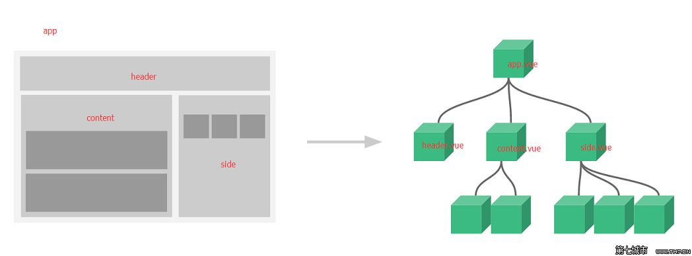
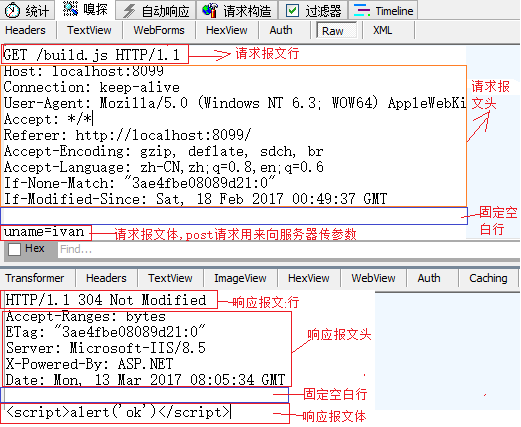

# 学习笔记

## 组件化开发


## Vue中的AJAX请求
> Vue可以借助于vue-resource来实现AJAX请求
* http请求报文
```html
浏览器与服务器数据交互是遵循http协议的，当浏览器要访问服务器的时候，浏览器需要将相关请求数据提交给服务器（例如：浏览器信息，url地址，参数等），通常是通过请求报文来提交的
    
    请求报文的格式分为：
        1、请求报文行
        2、请求报文头
        3、请求报文体
```
* http响应报文
```html
当浏览器请求服务器的时候，服务器需要将数据返回给浏览器，这种数据是通过响应报文响应回浏览器的

     响应报文的格式分为：
        1、响应报文行
        2、响应报文头
        3、响应报文体
```
* 请求报文和响应报文配图


### get
```html
写法格式：
     this.$http.get('请求的url', [可选参数对象，使用{}传参]).then(成功回调函数, 失败回调函数);

    成功回调函数参数对象主要属性说明：
    1、url ： 请求的原始url
    2、body： 响应报文体中的数据（我们通常用这个属性获取服务器返回的数据）
    3、其他属性请看文档

    举例：
     this.$http.get('http://vuecms.ittun.com/api/getlunbo?id=1').then(function(res){console.log(res.body)}, function(err){//err是异常数据});
```
### post
```html
写法格式：
     this.$http.post('请求的url',[可选参数请求报文体对象body,使用{}传参], [可选参数对象，使用{}传参]).then(成功回调函数, 失败回调函数);

    成功回调函数参数对象主要属性说明：
    1、url ： 请求的原始url
    2、body： 响应报文体中的数据（我们通常用这个属性获取服务器返回的数据）
    3、其他属性请看文档

    注意点：
    $http.post()方法中的第二个参数固定写成：{emulateJSON:true},否则可能造成服务器无法接收到请求报文体中的参数值

    举例：
     this.$http.post('http://vuecms.ittun.com/api/adddata?id=1'  //请求的url
     ,{content:'hello'}  //请求报文体中传入的参数对象，多个使用逗号分隔
     ,{emulateJSON:true}  //固定写法，保证服务器可以获取到请求报文体参数值
     ).then(function(res){console.log(res.body)}, function(err){//err是异常数据});
```
### jsonp
```html
jsonp请求主要用来解决ajax跨域请求问题，使用jsonp实现跨域首先要保证服务器api支持jsonp请求的格式


    写法格式：
     this.$http.jsonp('请求的url', [可选参数对象，使用{}传参]).then(成功回调函数, 失败回调函数);

    成功回调函数参数对象主要属性说明：
    1、url ： 请求的原始url
    2、body： 响应报文体中的数据（我们通常用这个属性获取服务器返回的数据）
    3、其他属性请看文档

    举例：
     this.$http.jsonp('http://vuecms.ittun.com/api/getlunbo?id=1').then(function(res){console.log(res.body)}, function(err){//err是异常数据});
```

## 动画

* css动画

```css
.show-enter-active,.show-leave-active{
            transition: all .3s ease;
            padding-left: 10px;
        }
        .show-enter,.show-leave-active{
            padding-left: 100px;
        }

```
```html
<div id="app">
    <button @click="change">控制动画的显示与隐藏</button>
    <transition name="show">
        <div v-if="isshow">这是个div</div>
    </transition>
</div>
```
```javascript
var vm = new Vue({
        el:'#app',
        data:{
            isshow:false
        },
        methods:{
            change:function () {
                this.isshow=!this.isshow
            }
        }
    })
```
* animate 动画

```html
<div id="app">
    <button @click="change">控制动画的显示与隐藏</button>
    <transition enter-active-class="fadeInRight" leave-active-class="fadeOutRight">
        <div v-if="isshow" class="animated">这是个div</div>
    </transition>

</div>
```
```javascript
var vm = new Vue({
        el:'#app',
        data:{
            isshow:false
        },
        methods:{
            change:function () {
                this.isshow=!this.isshow
            }
        }
    })
```

## 生命周期


> 链接文档：[Vue2.0 探索之路——生命周期和钩子函数的一些理解](https://segmentfault.com/a/1190000008010666)
